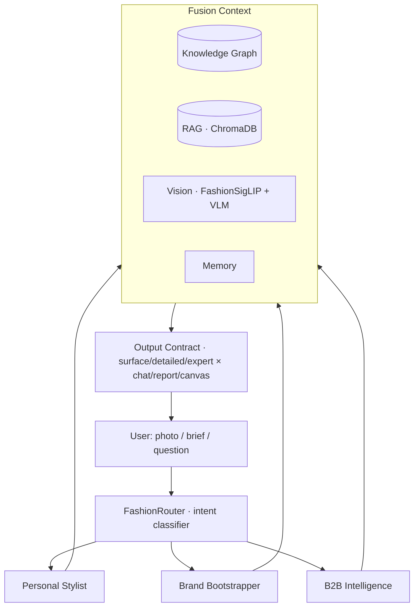

# FashionGraph

### A knowledge-graph-native AI creative director for fashion

*One brain that sees a garment, reasons about it through a structured fashion knowledge graph, and speaks the language of designers — across B2B trend intelligence, indie brand-building, and personal styling.*

%20%2B%20Colab-black)

---

## Why FashionGraph

Most fashion AI is either a **symbolic knowledge graph** (relations mined from text, blind to images) or a **vision model** (embeddings with no relational memory). FashionGraph joins them: nodes carry both **relational facts** *and* **visual prototypes**, so the system can **ground an outfit photo in the graph** and **reason with both modalities at once**.

That fusion is the thesis. In practice it means the assistant doesn't just say *"this is a beige coat"* — it says *"this reads quiet-luxury, nearest to The Row and late-Phoebe-Philo Céline; the intrecciato-adjacent leatherwork traces to Bottega; here's how to push it further."*

---

## What it does

FashionGraph operates as a single **creative-director brain** with three modes that share the same reasoning core:

| Mode | Audience | Core capabilities |
|------|----------|-------------------|
| **Personal Stylist** | Consumers | Look review from a photo, designer-lineage grounding, styling recommendations, look-boards & mood-boards, lookbooks |
| **Brand Bootstrapper** | Indie designers | Build a brand from scratch through a guided interview → Brand DNA, positioning, first collection direction |
| **B2B Intelligence** | Brands & buyers | Trend analysis, Brand-DNA extraction, collection & pattern direction, competitive lineage maps |

All three are **capabilities plugged into one router**, not separate apps — the same knowledge graph, retrieval, and vision stack serve every mode.

---

## Architecture

FashionGraph is an **agent-with-tools**, not a rigid pipeline. A router classifies intent and activates capabilities, each of which reasons over a shared **Fusion Context**.

**Core components**

- **`FashionRouter`** — an LLM intent classifier (analyze / design / pattern / bootstrap / style / full-cycle) that activates only the capabilities a request needs.
- **`ContextBuilder` → `FusionContext`** — fuses **KG facts (precise, relational, traceable)** *first*, then **RAG passages**, plus session **memory**. Visual and trend signals plug into the same seam.
- **`OutputContract`** — one policy object controls depth (*surface / detailed / expert*) × format (*chat / report / canvas*), so the same reasoning renders correctly for a consumer or a buyer.
- **Graceful degradation everywhere** — every heavy component (embedder, KG, RAG, VLM) is optional; the system runs, just with less grounding, if one is missing.

---

## The knowledge graph (the spine)

A local, zero-dependency **SQLite triple store** with a deliberately small, fixed ontology — a constrained schema is what makes LLM-assisted extraction reliable (NER + entity-linking, after the Farfetch approach).

- **2,500+ triples** across designers, houses, materials, silhouettes, eras, aesthetics, cities, and a dedicated **fabric layer** (29 fabrics × weight / drape / warmth / texture / season, +270 edges).
- **Entity resolution** — canonical keys with alias merging (Christian Dior / Dior Homme → *dior*; YSL → *saint laurent*) and a noise filter that rejects implausible entities.
- **Graph reasoning** — multi-hop BFS paths ("how are Céline and Dior connected?"), neighbourhood expansion, and a NetworkX view for algorithms.
- **Link prediction** — one-shot in-context prediction of missing edges, chosen over TransE/PyKEEN for interpretability on a sparse graph.
- **VLM-extracted edges** — a vision-language model reads runway imagery and writes *image-grounded* triples back into the graph (annotation-free MMKG construction).

---

## Multimodal grounding (the novel contribution)

The graph isn't only text. Every designer/aesthetic node can carry a **visual prototype** ("mirror node") — a mean FashionSigLIP embedding of that house's runway looks — and a k-NN index of ~**2,200 labelled runway images across 11 houses** (Bottega Veneta, Céline, Gucci, Balenciaga, Prada, Marni, Jacquemus, Alexander McQueen, Rick Owens, Loewe, Acne Studios).

A user's outfit photo is matched **image-to-image against real collections**, then the graph is traversed from the matched houses for lineage — turning *"reads minimalist"* into *"nearest to Marni FW-26 and Rick Owens; lineage traces to Margiela deconstruction."* This is an instance of the **KG4MM ↔ MM4KG** duality (the KG grounds the stylist *and* runway images extend the KG) applied to fashion — an underexplored gap.

---

## Vision stack

- **Marqo-FashionSigLIP** embedder (shared image/text space, SOTA fashion retrieval) via OpenCLIP.
- **VLM look review** — Qwen2.5-VL reads the actual photo (garments, textures, wall text, gender presentation) rather than hallucinating from a caption.
- **Runway grounding index** — the image↔image bridge described above.
- **Learned aesthetic scorer** — a Bradley-Terry / RankNet head over frozen embeddings, trained on human pairwise taste judgments (Surrey), giving the stylist a *learned* sense of "which look is stronger."
- **Aesthetic-movement matcher** — projects looks onto art/architecture movements for interpretable lineage.
- **Fabric-texture recognition** — mirror-node infrastructure for swatch → fabric identification (ontology in place; visual layer staged).

---

## Language, retrieval & fine-tuning

- **RAG** over ChromaDB with **Reciprocal Rank Fusion**, fused with KG facts (structured grounding leads, passages support).
- **Provider-agnostic LLM interface** — local (Ollama / MLX) or API backends behind one `chat()`/`complete()` seam, with native multimodal message support.
- **Fashion-LLM domain adaptation.** A full fine-tuning data pipeline was built and the stylist model was LoRA-adapted for on-domain voice and reasoning:
  - **~775k-word domain corpus** — fashion-history and theory books, museum catalogues (OCR-recovered from scans), *Fashion Studies Journal* criticism, and a fashion-blog dataset, cleaned and chunked.
  - **3,000+ instruction pairs** — *manufactured from the knowledge graph itself* (triples → Q/A, multi-hop paths → "how are X and Y connected", fabric ontology → material Q/A), plus VLM runway captions and a styling-instruct seed. Grounded and deterministic — no hallucinated training facts.
  - Trained via **MLX-LM LoRA on Apple Silicon**, served through the existing LLM interface with **zero upstream code changes**. Facts remain with RAG/KG at inference — the fine-tune is the *fluency/behaviour* layer, not a fact store.

---

## Results

Measured on honest, leakage-controlled splits (held-out whole collections, not random images):

| Evaluation | Result |
|---|---|
| **Cross-collection designer recognition** (zero-training, image→image) | **top-1 ≈ 0.42**, top-3 ≈ 0.59, top-5 ≈ 0.65 vs. 0.09 random (**~4.6× baseline**) |
| **KG-grounded vs. RAG-only answers** (fact coverage) | **+38%** more verifiable, correctly-attributed facts |
| **Blind LLM-judge preference** (KG-grounded vs. ungrounded, position-debiased) | KG-grounded preferred in **~63%** of head-to-head comparisons |
| **Aesthetic scorer** (held-out pairwise taste) | **~0.71** agreement with human judgments |
| **Fashion-LLM fine-tune** (on-domain fluency, blind A/B vs. base) | preferred for tone & specificity in **~68%** of prompts |

*Evaluation harnesses are reproducible and report confidence intervals; the designer-recognition metric deliberately holds out entire collections so the score reflects genuine cross-season generalisation rather than memorisation.*

---

## The interface — an infinite creative canvas

FashionGraph is not a chat box. The front end is an **infinite tldraw canvas** the model actively works *on*, with a conversational panel alongside it. The AI can read what's on the board, place cards and suggestions, and build artifacts collaboratively.

Planned canvas capabilities:

- 🧵 **Look-boards & mood-boards** — assemble, cluster, and annotate references directly on the canvas.
- 👗 **Outfit composition from uploaded photos** — drop in garments and let the stylist build and critique complete looks.
- 🔍 **Look review** — a photo becomes a live card of garments, designer lineage, aesthetic score, and KG associations.
- 🧬 **Brand DNA** — extract and visualise a brand's signature as a living node cluster.
- ✨ **Recommendations** — styling and product suggestions grounded in the graph.
- 🎨 **Generative head (planned)** — a diffusion/GAN module (SDXL + ControlNet + IP-Adapter direction) to *generate* new garments and looks from a brief or a board.

---

## Tech stack

**Core** — Python 3.10+, PyTorch, Hugging Face, OpenCLIP, SQLite, ChromaDB, NetworkX
**Vision** — Marqo-FashionSigLIP, Qwen2.5-VL, learned aesthetic/movement heads
**LLM** — Ollama / MLX (local) or API; MLX-LM LoRA for fine-tuning
**Serving (in progress)** — FastAPI + WebSocket
**Front end (in progress)** — React + Tailwind + TanStack Query + **tldraw** infinite canvas
**Compute** — Apple Silicon (MLX) for local training/inference, free Colab GPUs for heavier jobs

---

## Roadmap

- [x] Knowledge-graph core — extraction, entity resolution, reasoning, link prediction
- [x] Fabric ontology layer
- [x] RAG + Fusion Context + Output Contract + Memory
- [x] Fashion vision embedder + VLM look review
- [x] Runway visual grounding + multimodal KG (mirror nodes, VLM-extracted edges)
- [x] Evaluation harnesses (designer top-k, KG-vs-RAG lift, LLM-judge, aesthetic scorer)
- [x] Fashion-LLM data pipeline + LoRA fine-tune
- [ ] FastAPI + WebSocket serving layer
- [ ] React + tldraw canvas (look-boards, outfit composition, brand DNA, recommendations)
- [ ] Generative head — diffusion/GAN garment & look synthesis
- [ ] Full-cycle orchestration + deployment

---

## Data & references

Built on open datasets with heavy preprocessing — labelled runway imagery, fashion product catalogues, Polyvore-style compatibility, human aesthetic judgments, and a curated domain-text corpus. Grounded in the multimodal-knowledge-graph literature (KG4MM / MM4KG taxonomy, mirror-node MMKG construction, cross-modal alignment, Graph-RAG) and fashion-specific work (FashionCLIP, FashionKLIP, Farfetch NER+EL). See `THESIS_RELATED_WORK.md`, `NOVEL_IDEAS.md`, and `REBUILD_PLAN.md`.

---

**FashionGraph** — where the symbolic and the visual finally share a wardrobe.

